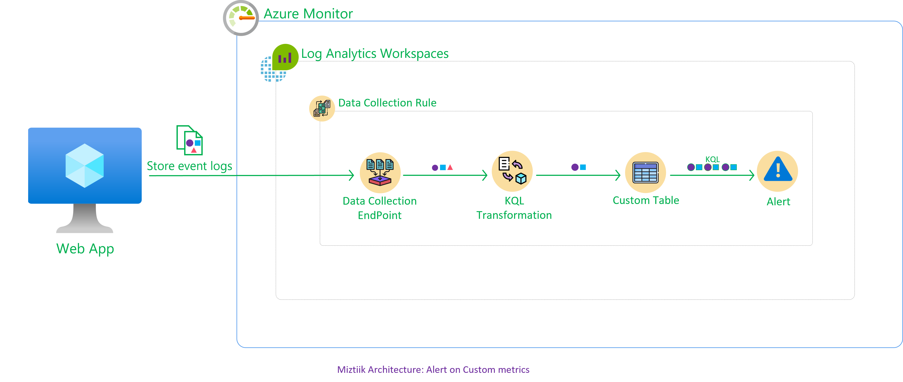
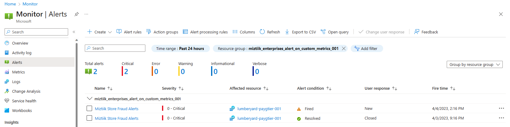
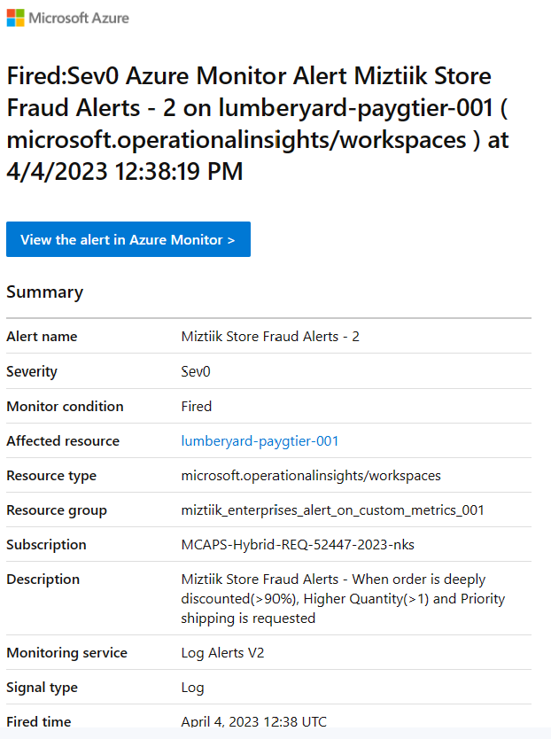

# Azure Virtual Machine Access To Blob Storage With User Identity

The developer at Mystique Unicorn are looking for a way store their order events coming from their stores across the world. They are currently using Azure Blob storage for their data lake and would like to store these events there.  A sample of the event is shown below. 

```json
{
    "request_id": "fef1127f-65df-4bca-bc58-e102fb65ee70",
    "store_id": 6,
    "store_fqdn": "m-web-srv-011.internal.cloudapp.net",
    "store_ip": "10.0.0.4",
    "cust_id": 989,
    "category": "Laptops",
    "sku": 126551,
    "price": 10.61,
    "qty": 6,
    "discount": 2.7,
    "gift_wrap": false,
    "variant": "black",
    "priority_shipping": true,
    "ts": "2023-04-10T16:25:04.411091",
    "contact_me": "github.com/miztiik"
}
```

They would like to store the data by date so that they can query them easily. For example query the sales across stores based on store id on a given date. 

Can you show them how the can get started? 

## 🎯 Solutions

To store all the order events, we will create a blob container. To write the events to the container, lets use a user managed identity with it permission scoped narrowly to a specific blob conainer using Azure RBAC.<sup>[1], [2], [3]</sup>.




1. ## 🧰 Prerequisites

   This demo, instructions, scripts and bicep template is designed to be run in `westeurope`. With few or no modifications you can try it out in other regions as well(_Not covered here_).

   - 🛠 Azure CLI Installed & Configured - [Get help here](https://learn.microsoft.com/en-us/cli/azure/install-azure-cli)
   - 🛠 Bicep Installed & Configured - [Get help here](https://learn.microsoft.com/en-us/azure/azure-resource-manager/bicep/install)
   - 🛠 VS Code & Bicep Extenstions - [Get help here](https://learn.microsoft.com/en-us/azure/azure-resource-manager/bicep/install#vs-code-and-bicep-extension)

1. ## ⚙️ Setting up the environment

   - Get the application code

     ```bash
     git clone https://github.com/miztiik/azure-vm-to-blob-storage
     cd azure-vm-to-blob-storage
     ```

1. ## 🚀 Prepare the environment

   Let check you have Azure Cli working with 

    ```bash
      # You should have azure cli preinstalled
      az account show
    ```

    You should see an output like this,

   ```json
    {
      "environmentName": "AzureCloud",
      "homeTenantId": "16b30820b6d3",
      "id": "1ac6fdbff37cd9e3",
      "isDefault": true,
      "managedByTenants": [],
      "name": "YOUR-SUBS-NAME",
      "state": "Enabled",
      "tenantId": "16b30820b6d3",
      "user": {
        "name": "miztiik@",
        "type": "user"
      }
    }
   ```

1. ## 🚀 Deploying the application

   Let us walk through each of the stacks,

   - **Stack: Main Bicep**
     The params required for the modules are in `params.json`. Do modify them to suit your need.(_Especially the `adminPassword.secureString` for the VM. You are strongly encouraged to Just-In-Time access or use SSH key instead of password based authentication_). The helper deployment script `deploy.sh` will deploy the `main.bicep` file. This will create the following resoureces
     - Resource Group(RG)
     - VNet, Subnet & Virtual Machine
     - Virtual Machine(Ubuntu)
        - (_WIP_)Bootstrapped with custom libs using `userData` script.
     - Storage Account - `warehouseXXXX`
        - Blob Container - `store-events-xxx`
     - User Managed Identity
        - Scoped with contributor privileges with conditional access restricting to a container, (_For ex `store-events-xxx`_)
      - Identity attached to the VM

     After successfully deploying the stack, Check the `Resource Groups/Deployments` section for the resources.


1. ## 🔬 Testing the solution

   - **Connect to the VM**

      The Ubuntu vm _should_ be bootstrapped using `userData` to install python3, git and also Azure Blob Storage Client Library<sup>[4]</sup>. (_For some reason the userData, bootstrap script fails, [Let me know if know how to fix it](/issues))
      We will use a python script `az_python.py` to generate the store events data.

      - Connect to the using using Just In Time Access<sup>[4]</sup>.
      - Copy the `az_python.py` to the server.

        ```bash
        ssh miztiik@publicIPOfSever
        git clone https://github.com/miztiik/azure-vm-to-blob-storage
        cd azure-vm-to-blob-storage
        cd /var/azure-vm-to-blob-storage/app
        # In case the pre-reqs have not been installed, then you will have to run the bootstrap script manually
        ```

   - **Generate Log Data**

      For some reason the userData, bootstrap script fails, will fix it later. Until then manually copy the `generate_data.sh` from this repo to the server. _You may need elevated privileges to create log file in `/var/log`.


      ```bash
      sudo su
      cd /var/log/
      # Copy generate_data.sh to the server
      sh generate_data.sh &
      ```

      The script by default is configured to write one log entry every `5` seconds and generate a total `100000` log lines to`/var/log/miztiik*.json`

    
    - **Query in Azure Log Analytics Workspace**

      Login to Azure Log Anaytics portal. You should be able to find it under `/Miztiik_Enterprises_Custom_Logs_To_Monitor_xxx/providers/Microsoft.OperationalInsights/workspaces/lumberyard-payGTier-xxx",`. Navigate to logs, select the custom table(`lumberyardTablexxx_CL`) & `Run`

      
  

  1. **Troubleshooting Azure Monitor Agent**

      - In case if you are facing issues, log into the  VM and check the logs `/var/log/azure/Microsoft.Azure.Monitor.AzureMonitorLinuxAgent/` for potential causes.
      - Check if your account has Azure Data Lake v2 enabled

        ```sh
        az resource show \
          --name  warehousei5chd4011 \
          --resource-group Miztiik_Enterprises_azure_vm_to_blob_storage_011 \
          --resource-type "Microsoft.Storage/storageAccounts" \
          --query properties.isHnsEnabled
        ```
      - List Blob Access

        ```sh
          RG_NAME="MIZTIIK_ENTERPRISES_AZURE_VM_TO_BLOB_STORAGE_011"
          SA_ACCOUNT_NAME="warehousei5chd4011"
          CONTAINER_NAME="store-events-011"
          CONTAINER_NAME1="kuy-muy"

          az storage blob list \
              --container-name ${CONTAINER_NAME1} \
              --account-name ${SA_ACCOUNT_NAME} \
              --auth-mode login

          az storage blob directory list \
              --container-name ${CONTAINER_NAME} \
              -d default \
              --account-name ${SA_ACCOUNT_NAME} \
              --auth-mode login
        ```

        Upload file to blob,

        ```sh
        echo "hello world on $(date +'%Y-%m-%d')" > miztiik.log
        az storage blob upload \
          --account-name ${SA_ACCOUNT_NAME} \
          --container-name ${CONTAINER_NAME} \
          --name miztiik.log \
          --file miztiik.log \
          --auth-mode login
        ```

      
1. ## 📒 Conclusion

    Here we have demonstrated how to configure alerts based on custom logs. You can extend the solution to setup alerts actions groups & receive email notifications. An example of email notification is showin below,

    
  

1. ## 🧹 CleanUp

If you want to destroy all the resources created by the stack, Execute the below command to delete the stack, or _you can delete the stack from console as well_

- Resources created during [Deploying The Application](#-deploying-the-application)
- _Any other custom resources, you have created for this demo_

```bash
# Delete from resource group
az group delete --name Miztiik_Enterprises_xxx --yes
# Follow any on-screen prompt
```

This is not an exhaustive list, please carry out other necessary steps as maybe applicable to your needs.

## 📌 Who is using this

This repository aims to show how to Bicep to new developers, Solution Architects & Ops Engineers in Azure.

### 💡 Help/Suggestions or 🐛 Bugs

Thank you for your interest in contributing to our project. Whether it is a bug report, new feature, correction, or additional documentation or solutions, we greatly value feedback and contributions from our community. [Start here](/issues)

### 👋 Buy me a coffee

[](https://ko-fi.com/Q5Q41QDGK) Buy me a [coffee ☕][900].

### 📚 References


1. [Azure Docs: Azure RBAC][1]
1. [Azure Docs: Azure ABAC][2]
1. [Azure Docs: Azure RBAC Example Conditions][3]
1. [Azure Docs: Azure Blob Storage client library for Python][4]
1. [Azure Docs: Just In Time Access][4]


### 🏷️ Metadata


**Level**: 200

[1]: https://learn.microsoft.com/en-us/azure/role-based-access-control/conditions-role-assignments-portal
[2]: https://learn.microsoft.com/en-us/azure/role-based-access-control/conditions-overview
[3]: https://learn.microsoft.com/en-us/azure/storage/blobs/storage-auth-abac-examples?toc=%2Fazure%2Frole-based-access-control%2Ftoc.json
[4]: https://learn.microsoft.com/en-us/azure/storage/blobs/storage-quickstart-blobs-python


[5]: https://learn.microsoft.com/en-us/azure/defender-for-cloud/just-in-time-access-usage

[100]: https://www.udemy.com/course/aws-cloud-security/?referralCode=B7F1B6C78B45ADAF77A9
[101]: https://www.udemy.com/course/aws-cloud-security-proactive-way/?referralCode=71DC542AD4481309A441
[102]: https://www.udemy.com/course/aws-cloud-development-kit-from-beginner-to-professional/?referralCode=E15D7FB64E417C547579
[103]: https://www.udemy.com/course/aws-cloudformation-basics?referralCode=93AD3B1530BC871093D6
[899]: https://www.udemy.com/user/n-kumar/
[900]: https://ko-fi.com/miztiik
[901]: https://ko-fi.com/Q5Q41QDGK